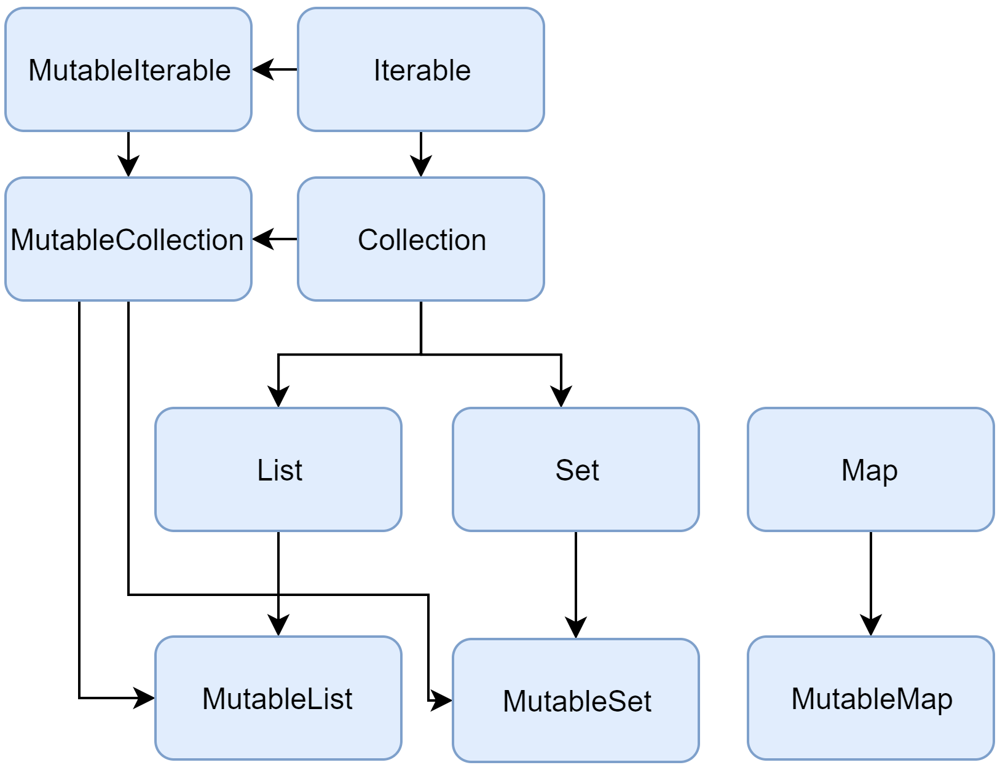
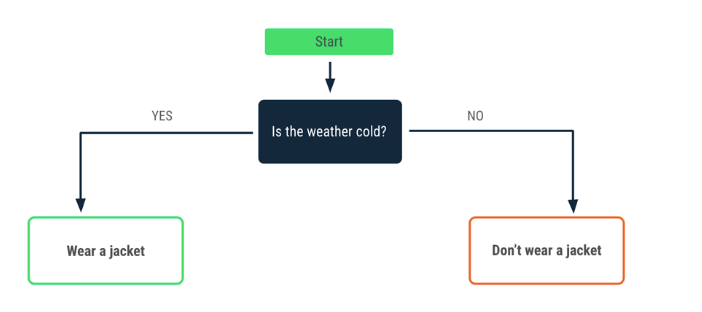
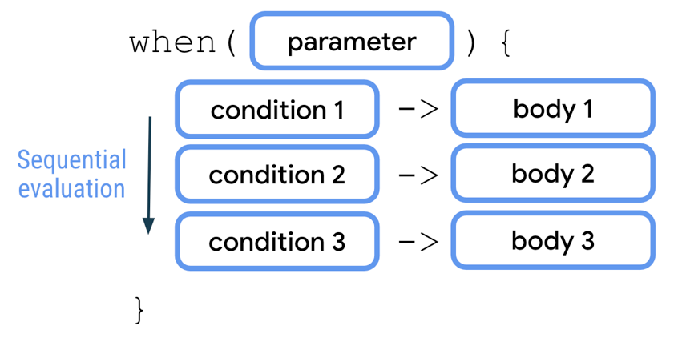

# kotlin-notes
[**WORK IN PROGRESS**]

Self-notes for kotlin from Complete Kotlin development masterclass 2023 by Catalin Stefan.

### Table of  content

1. [String and Variables](#stringAndVariables)
    1. [String](#string)
    2. [Variable](#variable)
    3. [User Input](#userInput)

### <a href="#string">String</a>

String is surrounded by double-quotes or triple-quotes.  
There are 2 types of string: **Escaped String** and **Raw String**

- Escaped string is declared within double quote (" ") and may contain escape characters like '\n'.
- Raw string is declared within triple quote (""" """) and may contain multiple lines of text without any escape
  characters.

```
fun main(args: Array<String>) { 
println("Hello")
println("String with escape character backslash \\, and quotes \".")
}

Output:
Hello String
String with escape character backslash \, and quotes ".
```

Example: String Bunny with escape characters

```
println("(\\(\\")
println("(-.-)")
println("O_(\")(\")")
```

Output:

```
(\(\
(-.-)
O_(")(")
```

#### Chars

A char is a single character, surrounded by single quotes.  
Example: 'A', 'a, ''.  
A string is composed of character (String of chars)

<a href="variables"></a>

### <a href="#variables">Variables</a>

A variable is a container of data.  
Examples:

```
var dogs = 3
var name = "Tommy"
```

Variables (var) can be changed/updated.  
Examples:

```
var age = 20
age = age+1 // OR age += 1
// age = 21
```

Note: we cannot change the variable type.  
Example:

```
var age = 20
age = twentyone
Error: Type mismatch
```

Variables can be changeable(mutable) and constants/read-only(immutable).  
mutable: var (can be changed)
immutable: val (can be read-only)
Example:

```
val age = 20
age = 21
Error: val cannot be reassigned
```

#### Variable names

Names can contain letters, numbers and underscores '_'. Cannot use space or kotlin keywords(println, var, val, etc.).
Names can start with letters or underscores, I personally prefer letters and use underscores to separate words. For
example, first name can be written as  
`var firstName = 'Tommy'` (also known as camel case) or  
`var first_name = 'Tommy' `

**Naming convention** - camelCase - firstName.

String Examples:

```
val catName = "Fluffy"
println("My cat's name is \"$catName\"")

var slashes = "Two types of slashesh \\ and /"
println(slashes)

var url = "https://www.google.com"
println(url)
```

Output:

```
My cat's name is "Fluffy"
Two types of slashesh \ and /
https://google.com
```  

Example: Generate a random Number

```  
println("Random.nextDouble(): ${Random.nextDouble()}")
println("Random.nextInt(): ${Random.nextInt()}") // random integer
println("Random.nextInt(1, 9): ${Random.nextInt(1, 9)}") // random integer 1 till 8
println("Random.nextInt(10): ${Random.nextInt(10)}") // random integer less than 10
```  

Output:

```  
Random.nextDouble(): 0.3519018166295108
Random.nextInt(): -1941111987
Random.nextInt(1, 9): 8
Random.nextInt(10): 6 
```  

<a href="userInput"></a>

### <a href="#userInput">User Input</a>

User input can come from many sources, and one way is from command line.  
We can use readLine().  
Example:

``` 
println("Enter user input")
val userInput = readLine() // read only one line
println("Your input string is: $userInput")
```   

Output:

``` 
Enter user input
hello
Your input string is hello
```  

Input a number as a String and convert to integer.  
The `readLine()` command can return nothing(null), then we can use `?:""`, asif the `readLine()` returns null, then
empty string will be used `""`.

```  
println("Enter user input")
val userInput = readLine()?:"" // if empty then use "" (empty string)
println("Your input times 5 is: ${userInput.toInt()*5}")  
```  

Output:

```  
Enter user input
5
Your input times 5 is: 25
```  

Example: Welcome

```
println("What is your name?")
val name =  readLine()
println("Welcome, $name")
```

Output:

```
What is your name?
Tommy
Welcome, Tommy
```

Example: Multiply a number by 5

```
print("Enter a number: ")
val number = readLine()?:""
val multipleOfFive = number.toInt() * 5
println("Number multiplied by 5 is: $multipleOfFive")
```

Output:

```
Enter a number: 4
Number multiplied by 5 is: 20
```

Example: Find out estimated age of user

```
print("Enter your birth year: ")
val birthYear = readLine()?:""
val currentYear = 2023
val result = currentYear - birthYear.toInt() 
println("Estimated age of the user is: ${result-1} or $result")
```

Output:

```
Enter your birth year: 1996
Estimated age of the user is: 26 or 27
```

<a href="numbersAndVariableTypes"></a>

### <a href="#numbersAndVariableTypes">Numbers And Variable Types</a>

Different types are stored in memory in different ways.  
Number types have limits.

| type  | size | min value                    | max value                    |
|-------|------|------------------------------|------------------------------|
| byte  | 8    | -128                         | 127                          |
| short | 16   | -32768                       | 32767                        |
| int   | 32   | -2147483648 (-2^31)          | 2147483647    (2^31-1)       |
| long  | 64   | -9223372036854775808 (-2^64) | 9223372036854775807 (2^64-1) |

-> Know the type of variable.

```
var pi = 3.141592
println("Type of pi: ${pi::class.java}")

var name = "Tommy"
println("Type of name: ${name::class.java}")

var population = 75000000000
println("Type of population: ${population::class.java}")
```

Output:

```
Type of pi: double
Type of name: class java.lang.String
Type of population: long
```

Exercise:

```
print("Enter a Number: ")
var userInput = readLine()
var doubleNumber = 29.99
var output = doubleNumber * (userInput?.toInt() ?: 1) // if null then 1
println("The output variable ($output) type is: ${output::class.java}")
```

Output:

```
Enter a Number: 44
The output variable (1319.56) type is: double
```

#### Implicit vs Explicit variable types

Implicit variable types are decided by Kotlin.  
Example: `val cat = 3 // Int`

Explicit variable types are decided by us. We can instruct kotlin to assign a different type to our variable.  
Example: `val cat:Byte = 5`  
`val floatVal: Float = 29.99F` Or `val floatValue = 29.99F`  
`val longVal: Float = 29` Or `val longVal = 29L`

<a href="operatorsAndBooleans"></a>

### <a href="#operatorsAndBooleans">Operators And Booleans</a>

#### Operators:

Referred From: https://www.w3schools.com/kotlin/kotlin_operators.php

##### Arithmetic Operators

| Operator | Name           | Description                      | Example |
|----------|----------------|----------------------------------|---------|
| +        | Addition       | Adds together two values         | x + y   |
| -        | Subtraction    | Subtracts one value from another | x - y   |
| *	       | Multiplication | Multiplies two values            | x * y   |
| /        | Division       | Divides one value from another   | x / y   |
| %        | Modulus        | Returns the division remainder   | x % y   |
| ++       | Increment      | Increases the value by 1         | ++x     |
| --       | Decrement      | Decreases the value by 1         | --x     |

##### Assignment Operators

| Operator | Example | Same As   |
|----------|---------|-----------|
| =        | x = 5   | x = 5     |
| +=       | x += 3  | x = x + 3 |
| -=       | x -= 3  | x = x - 3 |
| *=       | x *= 3  | x = x * 3 |
| /=       | x /= 3  | x = x / 3 |
| %=       | x %= 3  | x = x % 3 |

##### Comparison Operators

| Operator | Name                     | Example |
|----------|--------------------------|---------|
| ==       | Equal to                 | x == y  |
| !=       | Not equal                | x != y  |
| \>       | Greater than             | x > y   |
| <        | Less than                | x < y   |
| >=       | Greater than or equal to | x >= y  |
| <=       | Less than or equal to    | x <= y  |

##### Logical Operators

| Operator     | Name        | Description                                             | Example                  |
|--------------|-------------|---------------------------------------------------------|--------------------------|
| &&           | Logical and | Returns true if both statements are true                | x < 5 && x < 10          |
| &#124;&#124; | Logical or  | Returns true if one of the statements is true           | x < 5 &#124;&#124; x < 4 |
| !            | Logical not | Reverse the result, returns false if the result is true |

Remainder: See all the section objectives to create a table of content 

Exercise:

```
var a =76.254
var b = 3.867
println("Addition of $a and $b: ${a+b}")
println("Subtraction of $a and $b: ${a-b}")
println("Multiplication of $a and $b: ${a*b}")
println("Division of $a and $b: ${a/b}")
println("Remainder of $a and $b: ${a%b}")
```
Output:
```
Addition of 76.254 and 3.867: 80.12100000000001
Subtraction of 76.254 and 3.867: 72.387
Multiplication of 76.254 and 3.867: 294.87421800000004
Division of 76.254 and 3.867: 19.719162141194726
Remainder of 76.254 and 3.867: 2.781000000000005
```
Exercise: Read from the console the amount the user has in their bank account. The interest on that account is 5.5% per year. How much would that user have in 5 years?

```
print("Please enter your current bank balance: ")
var principal = readLine()?:"1"
print("Please enter rate of interest per annum: ")
val rateOfInterest = readLine()?:""
print("Please enter number of years: ")
val years = readLine()?:"0"

var balanceWithInterest = principal.toDouble() * ((1 + (rateOfInterest.toDouble()/100/1)).pow(years.toDouble()))  // P(1+(r/n)^years)
println("Your bank balance with interest of $rateOfInterest per year for the period of $years years is: $balanceWithInterest")
```

Output:
```
Please enter your current bank balance: 1000
Please enter rate of interest per annum: 5.5
Please enter number of years: 5
Your bank balance with interest of 5.5 per year for the period of 5 years is: 1306.9600064093747
```

#### Booleans:  
 It can only have True/False value.  
 Is very memory efficient, enables Logical Operators, enables program Flow Control.  

Exercise: A farmer has 3 cows, of which only one produces milk. He has two children. He is trying to apply for funding. The requirements are  
- You must have no more than 5 animals
- Animals must produce something that can be sold
- Regardless of the other conditions, funding will be approved if the family has 3 or more members  
Does the farmer receive the funding?
```
var noOfCows = 3
var givesMilk = 1
var noOfKids = 2
var conditionOne = noOfCows <= 5
var conditionTwo = givesMilk > 0
var conditionThree = (1 + noOfKids) >= 3

    if (conditionOne && conditionTwo || conditionThree)
        println("Farmer gets funding")
    else
        println("Farmaer does not get funding")
```
Output:
```
Farmer gets funding
```

### <a href="#nullability">Nullability</a>

#### Null values:

- No value is present. 
- If you use a variable with null value, your program will crash with NullPointerException (NPE)
- Kotlin guards against null values, giving us Compilation Error.
- Kotlin differentiates between variables that can be null(using '?') and those that cannot.  
  Example:  
  ```
  val herName: String = "Lilly" // (Cannot be null, must be given a value. Cannot assign null)  
  val hisName: String? = null // (Can be null, so giving a value is optional)
  ```
- **Null safe calls**: 
  - Nullable Operator: '?' (used for nullable variable)

Exercise:
  ```
var catName:String? = "Lucy"
println(catName?.length)
println(catName.length) // compile-time error (Surround by null check)
catName = null
println(catName?.length)

  ```

- Arithmetic Operators
 ```
var number:Int? = 10
println(number?.plus(1)) // 11
println(number?.minus(1)) // 9
println(number?.div(5)) // 2
println(number?.rem(4)) // 2
println(number?.times(2)) // 20
  ```

- Null operator - Elvis Operator(?:)  
  Guarantees a result returned  
  Either the actual result for a nun-null variable, or a default value
  ```
    var catName: String? = null
    println(catName?:"This cat has no name")
    catName = "Fluffy"
    println(catName?:"This cat has no name")
  ```
  Output:
    ```  
    This cat has no name
    Fluffy
     ```
  
- Non-null assertions
  !!. -> A developer guarantee that the variable is not null.  
  **Warning:** : This bypasses all the language checks for the null-safety. Can trigger a program to crash.  

  ```
  val catName: String? = null
  println(catName!!.length)
  // If the value is null then the program will crash.
  ```

Practice: Elvis and assertions
Print input message or default message  
```
print("Enter the message:")
var inputMessage = readLine()
println(inputMessage.let {
when (it) {
"" -> "Hello, welcome"
else -> it
}
})
 ```

Read if input number is not null and multiply by 5
 ```
val number: Int? = readLine()?.toIntOrNull()
println(number!!.times(5))
 ```

// Exercise: A product costs 29.99. Ask a user at the console how many products they want to buy. If the read value is null, use the default of one. Print the total of the purchase.
 ```
    val cost = 29.99
    val items: Int? = readLine()?.toIntOrNull()?:1 // When value is null, items= 1
    println("The cost of $items items is: ${items?.times(cost)}")

// The cost of 4 items is: 119.96
// The cost of 1 items is: 29.99
 ```

### <a href="#handlingExceptions">Handling Exceptions</a>


#### 1. What is an Exception?
An unexpected event in a program. A System cannot recover from an exception, we need to mitigate it ourselves. 
Execution is stopped and data is lost.  
Exceptions always have a message, by default, and it is good practice having a message when creating custom Exception.

#### 2. try-catch
A way to manage exception.
```
    print("Enter input:")
    var test = readLine()
    try {
        println(test?.toInt())
    } catch (e: Exception) {
        println("An exception has occurred ${e.localizedMessage}")
    }
    
    // Enter input:test
       An exception has occurred For input string: "test"
```

#### 3. finally
A 'finally' block will be executed whether or not an exception occurs. 
```
    print("Enter a number:")
    var input = readLine()
    try {
        println(input?.toInt())
    } catch (e: Exception) {
        println("Exception has occurred with $e")
    } finally {
        println("Finally block, the input was $input")
    }
    
    // Output
    Enter a number:4
    4
    Finally block, the input was 4

```
#### 4. throw
A way to generate your own exceptions.  
Can be used if you detect a state in your program that you cannot recover from.  

```
    print("Enter input:")
    var input = readLine()
    if(input.isNullOrBlank()) throw IllegalAccessException("Input is blank or null")
    else
        println("Input is: $input")
```
Exercise: Multiply by 5 if it is an Integer and print or else catch
```
    print("Enter an Integer:")
    var input = readLine()
    try {
    var result = input?.toInt()?.times(5)
    println("Result of $input * 5 = $result")
    } catch (e: Exception) {
    println("Input was not an integer, input $input was ${input!!::class.java}")
    }
    finally {
    println("Finish.")
    }
    // Output:
    Enter an Integer: 
    Input was not an integer, input  was class java.lang.String
    Finish.
```

### <a href="#collections">Collections</a>

A way to group of elements together.  
Zero or more elements.  
Same type of elements.  
Eg. [1,2,3,4,555,6,4], ["Dogs", "Cats", "Cow"]  

  
https://kotlinlang.org/docs/images/collections-diagram.png  

Note: Mutable means, they can be changed.  

#### List(Immutable)
Ordered collection.  
Elements can be accessed by the position(index[0,1,2,3....n])
 
Lists are immutable, that means we cannot add or remove elements. Meaning, we can only use elements that are present at creation time.
```
val animals = listOf("cat","dog","horse")
println(animals) // print wont change the order
```  

If we create an empty list then we must specify the element type  
`var colors = listOf<String>()
`  
Ordered collection that can contain duplicate elements.  
`var colors = listOf("yellow","green","red","red")`  
A list can contain null elements.  
`var colorsWithNull = listOf("red","green","yellow", null, null)`

Retrieve an element of the list.

`println(colors[0])  // yellow`
`println(colors.get(0)) // yellow`
`println(colors[5]) // ArrayIndexOutOfBoundsException`

Get size of the list.
`println(colors.size) // 4`

#### ArrayList(Mutable)

A mutable list is a changeable list.  
`var colors = arrayListOf("blue","red")`

We can add/remove elements
```
var colors = arrayListOf("blue","red")
colors.add("green")
println(colors) // [blue, red, green]
colors.remove("green") // [blue, red]
colors.removeAt(0) // [red]
```
We can add/remove another collection.
```
var moreColors = listOf("white","black","grey")
colors.addAll(moreColors)
println(colors) // [red, white, black, grey]
colors.removeAll(moreColors)
println(colors) // [red]
```  
If a array contains duplicate elements then it will just remove the first element.
``` 
var animals = arrayListOf("dogs","cats","dogs")
animals.remove("dogs") 
println(animals) // [cats, dogs]
``` 
Exercise:  
You have a number of items on your desk.  
`val items = arrayListOf(“laptop”, “mouse”, “pen”, “paper”, “mug”, “phone”)
`. You clean up your desk and remove as many items as you can to be more productive.
`val removedItems = listOf(“pen”, “paper”, “mug”, “phone”)`. Print out the remaining items.
``` 
val items = arrayListOf("laptop", "mouse", "pen", "paper", "mug", "phone")
val removedItems = listOf("pen", "paper", "mug", "phone")
items.removeAll(removedItems)
println(items) // [laptop, mouse]
```

#### List functions
```
var colors = listOf("yellow","green","red","red")
var colorsWithNull = listOf("red","green","yellow", null, null)
println(colors) // [yellow, green, red, red]
println(colors.size) // 4
println(colors.contains("red")) // true
println(colors.containsAll(colorsWithNull)) // false(it does not contain 'null')
println(colors.indexOf("red")) // first index of 'red' -> 2
println(colors.lastIndexOf("red")) // last index -> 3
```

#### ArrayList  functions


#### Set
Is a group of UNIQUE elements.  
The order has no significance  
We can go through the elements one by one(iterate over them), but the order is not defined  

#### Map

A set of key-value pair.  (keys are sets, as the keys are always unique)  
Keys are unique(set)  
Each key maps to exactly one value  
Values can have duplicates.  
Eg. {1=one,2-two,5=five# kotlin-notes

Self-notes for kotlin from Complete Kotlin development masterclass 2023 by Catalin Stefan.

### Table of  content

1. [String and Variables](#stringAndVariables)
    1. [String](#string)
    2. [Variable](#variable)
    3. [User Input](#userInput)

<a href="string"></a>

### <a href="#string">String</a>

String is surrounded by double-quotes or triple-quotes.  
There are 2 types of string: **Escaped String** and **Raw String**

- Escaped string is declared within double quote (" ") and may contain escape characters like '\n'.
- Raw string is declared within triple quote (""" """) and may contain multiple lines of text without any escape
  characters.

```
fun main(args: Array<String>) { 
println("Hello")
println("String with escape character backslash \\, and quotes \".")
}

Output:
Hello String
String with escape character backslash \, and quotes ".
```

Example: String Bunny with escape characters

```
println("(\\(\\")
println("(-.-)")
println("O_(\")(\")")
```

Output:

```
(\(\
(-.-)
O_(")(")
```

#### Chars

A char is a single character, surrounded by single quotes.  
Example: 'A', 'a, ''.  
A string is composed of character (String of chars)

<a href="variables"></a>

### <a href="#variables">Variables</a>

A variable is a container of data.  
Examples:

```
var dogs = 3
var name = "Tommy"
```

Variables (var) can be changed/updated.  
Examples:

```
var age = 20
age = age+1 // OR age += 1
// age = 21
```

Note: we cannot change the variable type.  
Example:

```
var age = 20
age = twentyone
Error: Type mismatch
```

Variables can be changeable(mutable) and constants/read-only(immutable).  
mutable: var (can be changed)
immutable: val (can be read-only)
Example:

```
val age = 20
age = 21
Error: val cannot be reassigned
```

#### Variable names

Names can contain letters, numbers and underscores '_'. Cannot use space or kotlin keywords(println, var, val, etc.).
Names can start with letters or underscores, I personally prefer letters and use underscores to separate words. For
example, first name can be written as  
`var firstName = 'Tommy'` (also known as camel case) or  
`var first_name = 'Tommy' `

**Naming convention** - camelCase - firstName.

String Examples:

```
val catName = "Fluffy"
println("My cat's name is \"$catName\"")

var slashes = "Two types of slashesh \\ and /"
println(slashes)

var url = "https://www.google.com"
println(url)
```

Output:

```
My cat's name is "Fluffy"
Two types of slashesh \ and /
https://google.com
```  

Example: Generate a random Number

```  
println("Random.nextDouble(): ${Random.nextDouble()}")
println("Random.nextInt(): ${Random.nextInt()}") // random integer
println("Random.nextInt(1, 9): ${Random.nextInt(1, 9)}") // random integer 1 till 8
println("Random.nextInt(10): ${Random.nextInt(10)}") // random integer less than 10
```  

Output:

```  
Random.nextDouble(): 0.3519018166295108
Random.nextInt(): -1941111987
Random.nextInt(1, 9): 8
Random.nextInt(10): 6 
```  

<a href="userInput"></a>

### <a href="#userInput">User Input</a>

User input can come from many sources, and one way is from command line.  
We can use readLine().  
Example:

``` 
println("Enter user input")
val userInput = readLine() // read only one line
println("Your input string is: $userInput")
```   

Output:

``` 
Enter user input
hello
Your input string is hello
```  

Input a number as a String and convert to integer.  
The `readLine()` command can return nothing(null), then we can use `?:""`, asif the `readLine()` returns null, then
empty string will be used `""`.

```  
println("Enter user input")
val userInput = readLine()?:"" // if empty then use "" (empty string)
println("Your input times 5 is: ${userInput.toInt()*5}")  
```  

Output:

```  
Enter user input
5
Your input times 5 is: 25
```  

Example: Welcome

```
println("What is your name?")
val name =  readLine()
println("Welcome, $name")
```

Output:

```
What is your name?
Tommy
Welcome, Tommy
```

Example: Multiply a number by 5

```
print("Enter a number: ")
val number = readLine()?:""
val multipleOfFive = number.toInt() * 5
println("Number multiplied by 5 is: $multipleOfFive")
```

Output:

```
Enter a number: 4
Number multiplied by 5 is: 20
```

Example: Find out estimated age of user

```
print("Enter your birth year: ")
val birthYear = readLine()?:""
val currentYear = 2023
val result = currentYear - birthYear.toInt() 
println("Estimated age of the user is: ${result-1} or $result")
```

Output:

```
Enter your birth year: 1996
Estimated age of the user is: 26 or 27
```

<a href="numbersAndVariableTypes"></a>

### <a href="#numbersAndVariableTypes">Numbers And Variable Types</a>

Different types are stored in memory in different ways.  
Number types have limits.

| type  | size | min value                    | max value                    |
|-------|------|------------------------------|------------------------------|
| byte  | 8    | -128                         | 127                          |
| short | 16   | -32768                       | 32767                        |
| int   | 32   | -2147483648 (-2^31)          | 2147483647    (2^31-1)       |
| long  | 64   | -9223372036854775808 (-2^64) | 9223372036854775807 (2^64-1) |

-> Know the type of variable.

```
var pi = 3.141592
println("Type of pi: ${pi::class.java}")

var name = "Tommy"
println("Type of name: ${name::class.java}")

var population = 75000000000
println("Type of population: ${population::class.java}")
```

Output:

```
Type of pi: double
Type of name: class java.lang.String
Type of population: long
```

Exercise:

```
print("Enter a Number: ")
var userInput = readLine()
var doubleNumber = 29.99
var output = doubleNumber * (userInput?.toInt() ?: 1) // if null then 1
println("The output variable ($output) type is: ${output::class.java}")
```

Output:

```
Enter a Number: 44
The output variable (1319.56) type is: double
```

#### Implicit vs Explicit variable types

Implicit variable types are decided by Kotlin.  
Example: `val cat = 3 // Int`

Explicit variable types are decided by us. We can instruct kotlin to assign a different type to our variable.  
Example: `val cat:Byte = 5`  
`val floatVal: Float = 29.99F` Or `val floatValue = 29.99F`  
`val longVal: Float = 29` Or `val longVal = 29L`

<a href="operatorsAndBooleans"></a>

### <a href="#operatorsAndBooleans">Operators And Booleans</a>

#### Operators:

Referred From: https://www.w3schools.com/kotlin/kotlin_operators.php

##### Arithmetic Operators

| Operator | Name           | Description                      | Example |
|----------|----------------|----------------------------------|---------|
| +        | Addition       | Adds together two values         | x + y   |
| -        | Subtraction    | Subtracts one value from another | x - y   |
| *	       | Multiplication | Multiplies two values            | x * y   |
| /        | Division       | Divides one value from another   | x / y   |
| %        | Modulus        | Returns the division remainder   | x % y   |
| ++       | Increment      | Increases the value by 1         | ++x     |
| --       | Decrement      | Decreases the value by 1         | --x     |

##### Assignment Operators

| Operator | Example | Same As   |
|----------|---------|-----------|
| =        | x = 5   | x = 5     |
| +=       | x += 3  | x = x + 3 |
| -=       | x -= 3  | x = x - 3 |
| *=       | x *= 3  | x = x * 3 |
| /=       | x /= 3  | x = x / 3 |
| %=       | x %= 3  | x = x % 3 |

##### Comparison Operators

| Operator | Name                     | Example |
|----------|--------------------------|---------|
| ==       | Equal to                 | x == y  |
| !=       | Not equal                | x != y  |
| \>       | Greater than             | x > y   |
| <        | Less than                | x < y   |
| >=       | Greater than or equal to | x >= y  |
| <=       | Less than or equal to    | x <= y  |

##### Logical Operators

| Operator     | Name        | Description                                             | Example                  |
|--------------|-------------|---------------------------------------------------------|--------------------------|
| &&           | Logical and | Returns true if both statements are true                | x < 5 && x < 10          |
| &#124;&#124; | Logical or  | Returns true if one of the statements is true           | x < 5 &#124;&#124; x < 4 |
| !            | Logical not | Reverse the result, returns false if the result is true |

Remainder: See all the section objectives to create a table of content

Exercise:

```
var a =76.254
var b = 3.867
println("Addition of $a and $b: ${a+b}")
println("Subtraction of $a and $b: ${a-b}")
println("Multiplication of $a and $b: ${a*b}")
println("Division of $a and $b: ${a/b}")
println("Remainder of $a and $b: ${a%b}")
```
Output:
```
Addition of 76.254 and 3.867: 80.12100000000001
Subtraction of 76.254 and 3.867: 72.387
Multiplication of 76.254 and 3.867: 294.87421800000004
Division of 76.254 and 3.867: 19.719162141194726
Remainder of 76.254 and 3.867: 2.781000000000005
```
Exercise: Read from the console the amount the user has in their bank account. The interest on that account is 5.5% per year. How much would that user have in 5 years?

```
print("Please enter your current bank balance: ")
var principal = readLine()?:"1"
print("Please enter rate of interest per annum: ")
val rateOfInterest = readLine()?:""
print("Please enter number of years: ")
val years = readLine()?:"0"

var balanceWithInterest = principal.toDouble() * ((1 + (rateOfInterest.toDouble()/100/1)).pow(years.toDouble()))  // P(1+(r/n)^years)
println("Your bank balance with interest of $rateOfInterest per year for the period of $years years is: $balanceWithInterest")
```

Output:
```
Please enter your current bank balance: 1000
Please enter rate of interest per annum: 5.5
Please enter number of years: 5
Your bank balance with interest of 5.5 per year for the period of 5 years is: 1306.9600064093747
```

#### Booleans:
It can only have True/False value.  
Is very memory efficient, enables Logical Operators, enables program Flow Control.

Exercise: A farmer has 3 cows, of which only one produces milk. He has two children. He is trying to apply for funding. The requirements are
- You must have no more than 5 animals
- Animals must produce something that can be sold
- Regardless of the other conditions, funding will be approved if the family has 3 or more members  
  Does the farmer receive the funding?
```
var noOfCows = 3
var givesMilk = 1
var noOfKids = 2
var conditionOne = noOfCows <= 5
var conditionTwo = givesMilk > 0
var conditionThree = (1 + noOfKids) >= 3

    if (conditionOne && conditionTwo || conditionThree)
        println("Farmer gets funding")
    else
        println("Farmaer does not get funding")
```
Output:
```
Farmer gets funding
```

### <a href="#nullability">Nullability</a>

#### Null values:

- No value is present.
- If you use a variable with null value, your program will crash with NullPointerException (NPE)
- Kotlin guards against null values, giving us Compilation Error.
- Kotlin differentiates between variables that can be null(using '?') and those that cannot.  
  Example:
  ```
  val herName: String = "Lilly" // (Cannot be null, must be given a value. Cannot assign null)  
  val hisName: String? = null // (Can be null, so giving a value is optional)
  ```
- **Null safe calls**:
    - Nullable Operator: '?' (used for nullable variable)

Exercise:
  ```
var catName:String? = "Lucy"
println(catName?.length)
println(catName.length) // compile-time error (Surround by null check)
catName = null
println(catName?.length)

  ```

- Arithmetic Operators
 ```
var number:Int? = 10
println(number?.plus(1)) // 11
println(number?.minus(1)) // 9
println(number?.div(5)) // 2
println(number?.rem(4)) // 2
println(number?.times(2)) // 20
  ```

- Null operator - Elvis Operator(?:)  
  Guarantees a result returned  
  Either the actual result for a nun-null variable, or a default value
  ```
    var catName: String? = null
    println(catName?:"This cat has no name")
    catName = "Fluffy"
    println(catName?:"This cat has no name")
  ```
  Output:
    ```  
    This cat has no name
    Fluffy
     ```

- Non-null assertions
  !!. -> A developer guarantee that the variable is not null.  
  **Warning:** : This bypasses all the language checks for the null-safety. Can trigger a program to crash.

  ```
  val catName: String? = null
  println(catName!!.length)
  // If the value is null then the program will crash.
  ```

Practice: Elvis and assertions
Print input message or default message
```
print("Enter the message:")
var inputMessage = readLine()
println(inputMessage.let {
when (it) {
"" -> "Hello, welcome"
else -> it
}
})
 ```

Read if input number is not null and multiply by 5
 ```
val number: Int? = readLine()?.toIntOrNull()
println(number!!.times(5))
 ```

// Exercise: A product costs 29.99. Ask a user at the console how many products they want to buy. If the read value is null, use the default of one. Print the total of the purchase.
 ```
    val cost = 29.99
    val items: Int? = readLine()?.toIntOrNull()?:1 // When value is null, items= 1
    println("The cost of $items items is: ${items?.times(cost)}")

// The cost of 4 items is: 119.96
// The cost of 1 items is: 29.99
 ```

### <a href="#handlingExceptions">Handling Exceptions</a>


#### 1. What is an Exception?
An unexpected event in a program. A System cannot recover from an exception, we need to mitigate it ourselves.
Execution is stopped and data is lost.  
Exceptions always have a message, by default, and it is good practice having a message when creating custom Exception.

#### 2. try-catch
A way to manage exception.
```
    print("Enter input:")
    var test = readLine()
    try {
        println(test?.toInt())
    } catch (e: Exception) {
        println("An exception has occurred ${e.localizedMessage}")
    }
    
    // Enter input:test
       An exception has occurred For input string: "test"
```

#### 3. finally
A 'finally' block will be executed whether or not an exception occurs.
```
    print("Enter a number:")
    var input = readLine()
    try {
        println(input?.toInt())
    } catch (e: Exception) {
        println("Exception has occurred with $e")
    } finally {
        println("Finally block, the input was $input")
    }
    
    // Output
    Enter a number:4
    4
    Finally block, the input was 4

```
#### 4. throw
A way to generate your own exceptions.  
Can be used if you detect a state in your program that you cannot recover from.

```
    print("Enter input:")
    var input = readLine()
    if(input.isNullOrBlank()) throw IllegalAccessException("Input is blank or null")
    else
        println("Input is: $input")
```
Exercise: Multiply by 5 if it is an Integer and print or else catch
```
    print("Enter an Integer:")
    var input = readLine()
    try {
    var result = input?.toInt()?.times(5)
    println("Result of $input * 5 = $result")
    } catch (e: Exception) {
    println("Input was not an integer, input $input was ${input!!::class.java}")
    }
    finally {
    println("Finish.")
    }
    // Output:
    Enter an Integer: 
    Input was not an integer, input  was class java.lang.String
    Finish.
```

### <a href="#collections">Collections</a>

A way to group of elements together.  
Zero or more elements.  
Same type of elements.  
Eg. [1,2,3,4,555,6,4], ["Dogs", "Cats", "Cow"]


Note: Mutable means, they can be changed.

#### List(Immutable)
Ordered collection.  
Elements can be accessed by the position(index[0,1,2,3....n])

Lists are immutable, that means we cannot add or remove elements. Meaning, we can only use elements that are present at creation time.
```
val animals = listOf("cat","dog","horse")
println(animals) // print wont change the order
```  

If we create an empty list then we must specify the element type  
`var colors = listOf<String>()
`  
Ordered collection that can contain duplicate elements.  
`var colors = listOf("yellow","green","red","red")`  
A list can contain null elements.  
`var colorsWithNull = listOf("red","green","yellow", null, null)`

Retrieve an element of the list.

`println(colors[0])  // yellow`
`println(colors.get(0)) // yellow`
`println(colors[5]) // ArrayIndexOutOfBoundsException`

Get size of the list.
`println(colors.size) // 4`

#### ArrayList(Mutable)

A mutable list is a changeable list.  
`var colors = arrayListOf("blue","red")`

We can add/remove elements
```
var colors = arrayListOf("blue","red")
colors.add("green")
println(colors) // [blue, red, green]
colors.remove("green") // [blue, red]
colors.removeAt(0) // [red]
```
We can add/remove another collection.
```
var moreColors = listOf("white","black","grey")
colors.addAll(moreColors)
println(colors) // [red, white, black, grey]
colors.removeAll(moreColors)
println(colors) // [red]
```  
If a array contains duplicate elements then it will just remove the first element.
``` 
var animals = arrayListOf("dogs","cats","dogs")
animals.remove("dogs") 
println(animals) // [cats, dogs]
``` 
Exercise:  
You have a number of items on your desk.  
`val items = arrayListOf(“laptop”, “mouse”, “pen”, “paper”, “mug”, “phone”)
`. You clean up your desk and remove as many items as you can to be more productive.
`val removedItems = listOf(“pen”, “paper”, “mug”, “phone”)`. Print out the remaining items.
``` 
val items = arrayListOf("laptop", "mouse", "pen", "paper", "mug", "phone")
val removedItems = listOf("pen", "paper", "mug", "phone")
items.removeAll(removedItems)
println(items) // [laptop, mouse]
```

#### List functions
```
var colors = listOf("yellow","green","red","red")
var colorsWithNull = listOf("red","green","yellow", null, null)
println(colors) // [yellow, green, red, red]
println(colors.size) // 4
println(colors.contains("red")) // true
println(colors.containsAll(colorsWithNull)) // false(it does not contain 'null')
println(colors.indexOf("red")) // first index of 'red' -> 2
println(colors.lastIndexOf("red")) // last index -> 3
```
There are many more function :)  
#### ArrayList  functions
```
val colors = arrayListOf("blue","red", "blue", "green")
colors[1] = "yellow" // OR colors.set(1,"yellow")
println(colors) // [blue, yellow, blue, green]
val subColors = colors.subList(1,3)
println(subColors) // [yellow, blue]
colors.clear()
println(colors) // []
println(colors.isEmpty()) // true
```
There are many more function :)  

Exercise:  
A zoo has a list of animals.   
val animals = arrayListOf(“lion”, “zebra”, “chimp”, “elephant”)  
A new panda bear cub has arrived. Print out the new list of animals.  
The lion has been sold to a different zoo. Print out the new list of animals.   
Does the zoo have both elephants and giraffes?
```
val animals = arrayListOf("lion","zebra","chimp","elephant") //[lion, zebra, chimp, elephant]
animals.add("panda bear cub")
println(animals) // [lion, zebra, chimp, elephant, panda bear cub]
println(animals.size) // 5
animals.remove("lion")
println(animals) // [zebra, chimp, elephant, panda bear cub]
println("Does the zoo has all the animals: ${animals.containsAll(listOf("elephant","giraffe"))}") 
        // Does the zoo has all the animals: false
```
#### Set(Immutable)
Is a group of UNIQUE elements.  
The order has no significance.    
We can go through the elements one by one(iterate over them), but the order is not defined.  
Cannot add or remove elements, we can use HashSets for that.  
```
val numbers = setOf(1,2,3,4,1)
println(numbers) // [1, 2, 3, 4] <- '1' is only printed once as set contains unique values
```

If we want to create an empty set then we must specify type of set.  
```
val numbers2 = setOf<Int>()
println(numbers2) // []
```
We can have a null, but no duplicates, only once  
```
val numbers3 = setOf(1,2,3,4,4,null,null)
println(numbers3) // [1, 2, 3, 4, null]
```

#### HashSet(Mutable)
HashSets are Sets with the capability to add/remove elements.  
Feature: Unique elements, can have null, can add/remove elements, un-ordered.  

    val numbers = hashSetOf(1,2,3,4,1)
    println(numbers) // [1, 2, 3, 4] <- '1' is only printed once as set contains unique values

Empty HashSet, we need to specify the type.  

    val numbers2 = hashSetOf<Int>()
    println(numbers2) // []

HashSet with null.

    val numbers3 = hashSetOf(1,2,3,4,4,null,null)
    println(numbers3) // [null, 1, 2, 3, 4]

Add one element to the HashSet

    numbers.add(44)
    println(numbers) // [1, 2, 3, 4, 44]

Add one hashSet to another, ignoring duplicates

    numbers3.addAll(numbers)
    println(numbers3) // [null, 1, 2, 3, 4, 44]

Remove one element for the set(if exists)

    numbers.remove(1)
    println(numbers) // [2, 3, 4, 44] <- removed all 1's

Remove all elements of a set

    numbers3.removeAll(numbers)
    println(numbers3) // [null, 1]

//    Exercise 1:

    val colors = hashSetOf<String>()
    colors.addAll(listOf("green", "red", "pink","red"))
    println(colors) // [red, pink, green]

    colors.remove("green")
    println(colors) // [red, pink]

Exercise 2:

    val objectsOnTable = hashSetOf("watch", "desktop", "laptop", "hub", "mobile")
    val objectsToRemove = setOf("mobile")
    objectsOnTable.removeAll(objectsToRemove)
    println(objectsOnTable) // [desktop, laptop, hub, watch]

Exercise 3:
You have a list of customers for your online store. A new customer has joined. Print the list of customers.
A customer has chosen to leave. Print the list of customers.

    val customers = hashSetOf("Tom", "Jerry", "Daffy", "Donald")
    val newCustomer = readLine()?:"" // Panther
    customers.add(newCustomer)
    println("List of customers: $customers") // List of customers: [Tom, Panther, Jerry, Daffy, Donald]

    customers.remove("Donald")
    println(customers) // [Tom, Panther, Jerry, Daffy]

**Functions for Sets and HashSets**

Set functions:

    val numbers = setOf(1, 2, 3, 4, 5, 6, 7)
    println(numbers.size) // 7
    println(numbers.contains(3)) // true
    println(numbers.containsAll(setOf(1,2,11))) // false
    println(numbers.isEmpty()) // false
    numbers.forEach { print("Number: $it ") }  // Number: 1 Number: 2 Number: 3 Number: 4 Number: 5 Number: 6 Number: 7

HashSet functions:

    val numbers = hashSetOf(1,2,3,4,5,6,7, null,7)
    println(numbers) // [null, 1, 2, 3, 4, 5, 6, 7]
    val newNumbers = setOf(5,6,7,8,9,10)
    numbers.retainAll(newNumbers)
    println("Retain numbers: $numbers") // Retain numbers: [5, 6, 7]
    numbers.clear()
    println(numbers) // []

Practice:

    val primeNumbers = setOf(2,3,5,7,11,13,17,19,23,29)
    println("Is 21 a prime number? ${primeNumbers.contains(21)}") // Is 21 a prime number? false
    println("Is 13 a prime number? ${primeNumbers.contains(13)}") // Is 13 a prime number? true

    val myDrinks = hashSetOf("water","coke","orange juice","beer")
    val theirDrink = hashSetOf("water","orange juice", "pineapple juice", "milk")
    // TODO("If you want to buy a drink that you both can enjoy, what are the options you have?")
    myDrinks.retainAll(theirDrink)
    println("Drinks that we both enjoy $myDrinks") // Drinks that we both enjoy [orange juice, water]


Exercise: Set and HashSet 

Your company has very strict dress code. Only certain color clothes can be worn in the office.
`val acceptedColors = hashSetOf(“white”, “black”, “grey”)` You have certain colors in your wardrobe.  
`val myColors = hashSetOf(“blue”, “red”, “black”, “green”)` What color clothes can you wear.
Your company has added another color, “red” to their list. What options do you have now?

    var acceptedColors = hashSetOf("white", "black", "grey")
    val myColors = hashSetOf("blue", "red", "black", "green")
    acceptedColors.retainAll(myColors)
    println("Clothes that I can wear are: $acceptedColors") // Clothes that I can wear are: [black]

    acceptedColors = hashSetOf("white", "black", "grey") // readded as acceptedColors changed afer retainAll
    acceptedColors.add("red")
    acceptedColors.retainAll(myColors)
    println("Clothes that I can wear now are: $acceptedColors") // Clothes that I can wear now are: [black, red]

#### Map
- Conceptually Maps are part of collections abut practically they are not.  
- A set of key-value pair.  (keys are sets, as the keys are always unique)  
- Keys are unique(set)  
- Each key maps to exactly one value  
- Values can have duplicates.  
- Eg. {1=one,2-two,5=five} OR a Dictionary(Words - Definition)
- Maps are immutable, HashMaps are mutable

```
val count = mapOf(Pair(1,"one"), Pair(2,"two"), Pair(3,"three"))
println(count) // {1=one, 2=two, 3=three}
println(count.get(2)) // count[2] -> two
// Get the whole SET of keys (they are unique)
println(count.keys) // [1,2,3]
// Get the collection of values (can have duplicates)
println(count.values) // [one, two, three]
```
```
val count = mapOf<Int, String>()
println(count) // {}
```

HashMap

    val countHash = hashMapOf(Pair(1,"one"), Pair(2,"two"), Pair(3,"three"))
    countHash[4] = "four"
    println(countHash) // {1=one, 2=two, 3=three, 4=four}
    val count = mapOf(Pair(20,"one"), Pair(30,"two"), Pair(40,"three"))
    countHash.putAll(count)
    println(countHash) // {1=one, 2=two, 3=three, 4=four, 20=one, 40=three, 30=two}
    countHash.remove(20)
    println(countHash) // {1=one, 2=two, 3=three, 4=four, 40=three, 30=two}
    countHash.replace(2, "TWO")
    println(countHash) // {1=one, 2=TWO, 3=three, 4=four, 40=three, 30=two}
    countHash.clear()
    println(countHash) // {} 

Practice: Map and HashMap

```
var count = hashMapOf(Pair(1,"un"), Pair(2, "deux"), Pair(3,"trois"))
println("value of 2 in french is ${count[2]}") // value of 2 in french is deux
println("value of 3 in french is ${count[3]}") // value of 3 in french is trois
count.put(4,"quatre") //OR  count[4] = "quatre"
println(count) // {1=un, 2=deux, 3=trois, 4=quatre}
```

```
var customers = mapOf(Pair("John", 1), Pair("Alice", 5), Pair("Bob", 3))
println("Is Alice a customer? : ${customers.containsKey("Alice")}, and she bought ${customers["Alice"]} products.")
    // Is Alice a customer? : true, and she bought 5 products.
println("Is Michael a customer? : ${customers.containsKey("Michael")}") // Is Michael a customer? : false
```

**Exercise**:  
You manage an amusement park, and you have a map that stores dates and attendance.   
`var attendance = hashMapOf(Pair(“23 Sept”, 2837), Pair(“24 Sept”, 3726), Pair(“25 Sept”, 6253))`  
Add a value for 26 Sept. How many people attended in total on 25 and 26 Sept? Is data for 22 Sept available?

    var attendance = hashMapOf(Pair("23 Sept", 2837), Pair("24 Sept", 3726), Pair("25 Sept", 6253))
    attendance["26 Sept"] = 1234
    println("The total number of people attending on 25 Sept and 26 Sept are: ${(attendance["25 Sept"]?:0) + (attendance["26 Sept"]?:0)}")
        //The total number of people attending on 25 Sept and 26 Sept are: 7487
    println("Are people attending on 22nd Sept: ${attendance.containsKey("22 Sept")}")
        // Are people attending on 22nd Sept: false


### <a href="#flowControl">Flow control  </a>

- Change the direction of execution of a program
- Make a decision
- Run a part of code multiple times
- Stop execution of a part of code

**Iterator**:
An iterator is an object that loops through elements of a collection.  
They are used when applying a same operation to all the elements.  

#### If conditional

https://developer.android.com/codelabs/basic-android-kotlin-compose-conditionals#1  

**if statement**
```
if(logical expression){
    //do something
} else{
}
```
```
print("Enter true if it is Night, else false:") // Enter true if it is Night, else false:false
val isNight = readLine()?:"true"
val night = isNight.toBoolean()
if(night){
    println("Sleep") // if isNight = true -> Sleep
}
else{
   println("Be active") // if isNight = false -> Be Active
}
```

```
print("Please input the client funds: ")
var input = readLine() ?: "100"
var clientFunds = input.toInt() // default 100
val price = 50
var clientProduct = 0
if (clientFunds > price) {
clientFunds -= price
clientProduct++
println("You have purchased $clientProduct products,")
println("You have $clientFunds funds.")
}
else{
println("You have insufficient funds: $clientFunds")
}
```
```
val petStore = listOf("Cat", "Dog", "Rabbit")
val hasCatFood = true
if (petStore.contains("Cat")) {
    if (hasCatFood) {
        println("Buy Cat and cat food") // output -> Buy Cat and cat food
    } else {
        println("Buy cat and place an order for cat food")
    }
} else {
     println("Don't buy anything")
}
```

**Exercise:**  

Define two variables

val hasEggs = true
val hasBacon = false
A man goes to the market. His instructions are:

If you find eggs, buy 12

If you buy eggs, and you also find bacon, buy two packs

Eggs cost 5 each.
A pack of bacon costs 20.
How much does the man spend at the market?

```
val hasEggs = true
val costEggs = 5
val hasBacon = false
val costBacon = 20
var moneySpent = 0

if (hasEggs) {
    println("Buying 12 eggs") // Buying 12 eggs
    moneySpent = 12 * costEggs
    if (hasBacon) {
        println("Buying 2 packs of bacon")
        moneySpent += 2 * costBacon
    }
    println("Money Spent: $moneySpent") // Money Spent: 60
}else{
     println("Did not buy anything")
}
```

**shorthand if**  
Curly brackets can be omitted if there is only one expression.
```
val number = 25
val isEven: String? = null
if (number % 2 == 0)
    println("Number is even")
else
    println("Number is odd")
```
Shorthand if expression looks like as below
```
if(number%2==0) isEven = "Number is Even" else isEven = "Number is odd"
```
Shorthand if with assignment
```
val isEven = if(number%2==0) "Number is Even" else "Number is odd"
println(isEven)
```

**Multiple branches**
```
if (expression A) {
// Do A
} else if (expression B) {
// or Do B
} else if (expression C) {
// Or Do C
} else {
// Or default action
}
```
Example:
```
print("Enter an animal: ")
val animal = readLine()?:""
if (animal == "dog") {
println("Animal is a dog")
} else if (animal == "cat") {
println("Animal is a cat")
} else if (animal == "rabbit") {
println("Animal is a rabbit")
} else {
println("Animal not found")
}
```

Practice:  
if single digit print the statement  
```
print("Please enter a number:")
val input = readLine() ?: "0"
val number = input.toInt()
if (number / 10 == 0) println("Number is single digit") else println("Number is multiple digit")
```

for multiple if branches
```
val responseCode = 404
val message = if(responseCode/100 == 1)
"Information response"
else if(responseCode/100 == 2)
"Success"
else if(responseCode/100 == 3)
"Redirect"
else if(responseCode/100 == 4)
"Client error"
else
"Server Error"
println("Message for response $responseCode: $message") // Message for response 404: Client error
```

Exercise:

You are designing a grading system for school exams. The total for an exam is 100 points, and you need to convert that into a grade A to F.

Design a program that reads in a number that represents a student’s grade, from 1 to 100 and prints out a grade.

A -> 90 to 100  
B -> 80 to 89  
C -> 70 to 79  
D -> 60 to 69  
E -> 50 to 59  
F -> everything else  
```
print("Enter exam points: ")
val input = readLine()?:""
val points = input.toInt()
val grade: String? = if(points>=90 && points <=100)
    "A"
else if(points>=80 && points <=89)
    "B"
else if(points>=70 && points <=79)
    "C"
else if(points>=60 && points <=69)
    "D"
else if(points>=50 && points <=59)
    "E"
else
    "F"
println(grade)

```

#### When conditional

  
https://developer.android.com/codelabs/basic-android-kotlin-compose-conditionals#2  

#### For loop 
- works on elements of a collection

`--> collection C -> for  each element in collection C -> do something`
#### While loop
- works on a boolean expression

`while(expression==true) -> do something`   
s(it will influence the expression, eventually making it false)

#### Expressions
**Arithmetic and Logical Expressions:**  

An expression consists of variables and operators that evaluate to a single value.  
Eg: `1+1 // 2` OR `326/72 * 15 + 93 % 13 // 62`  
We cannot use these kinds of expressions in conditional statements.  
We need expressions that evaluate a  boolean value -> `true` or `false`  
Eg: `1+1 == 2 // true` `1+1 == 5 // false`  
In conditional statements we can use any logical expressions.
Example:
```
if(326/72 * 15 + 93 % 13 == 62){
println("Math is easy") // Math is easy
}else{
println("Math is difficult")
}
```
```
val haveCat = true
val haveCatFood = true
if(haveCat && haveCatFood){
    println("Cat is happy")
}else{
    println("Oh no!")
}
```
**in keyword**
Checks whether a value is in a Collection or in a range.  
`"cat" in listOf("dog","cat","rabbit")` AND `5 in 1.....10`  
Example with collection:  
```
val favouritePet = "dog"
val availablePets = listOf("dog","cat","horse")
if(favouritePet in availablePets){ // in keyword
    println("YAY!")
}else{
    println("Oh no!")
}
if(favouritePet !in availablePets){   // !in keyword
    println("Please notify when you have a dog.")
}else{
    println("Yay!") // Yay!
}
```

Example with range:
```
println("Please input a number") // 60
val input = readLine() ?: ""
val number = input.toInt()
if(number !in 0..9){
    println("Your input is not single digit") // Your input is not single digit
}
```

Boolean returning function:  
A function can be used in a conditional statement if it returns a boolean.  
```
val animals = arrayListOf<String>()
if (animals.isEmpty()) {
    animals.add("Dog")
} else {
    animals.add("Cat")
}
println(animals) // [Dog]
```
```
val animals = arrayListOf<String>()
if (animals.add("Horse")) {
    println("Horse was added successfully") // Horse was added successfully
} else {
    println("Horse not was added")
}
println(animals) // [Horse]
```
Practice:  
```
val guestList = listOf("Alice", "Bob", "Carol", "John")
print("Please enter your name: ")
val guest = readLine() ?: ""
if (guest in guestList) {
    println("Please come in")
} else {
    println("Sorry, you are not on the list")
}
```
```
print("How many cats do you have? ")
val input = readLine() ?: "0"
val numberOfCats = input.toInt()
val howMany = if (numberOfCats in 1..3)
    "few cats"
else if(numberOfCats in 4..6)
    "several cats"
else
    "Many cats"
println("This lady has $howMany")
```

Exercise:
Ask a user to input their age.

If they are under 13, they are a child
If they are under 18, they are a teen
If they are older, they are an adult.

Use ranges to print out the correct message.

If the age is 0, convert it to 1.

```
print("Enter the age:")
val input = readLine() ?: "0"
var age = input.toInt()
if (age == 0) age = 1
if (age in 1..12) println("You are a child")
else if (age in 13..18) println("You are a child")
else println("You are an adult")
```
#### When condition


#### Question to search:
If `val` means immutable and it cannot be changed, how can we make changes to arrayList

Formatting:
1-> linking every section
2_. code formatting, adding <tab> wherever needed 
